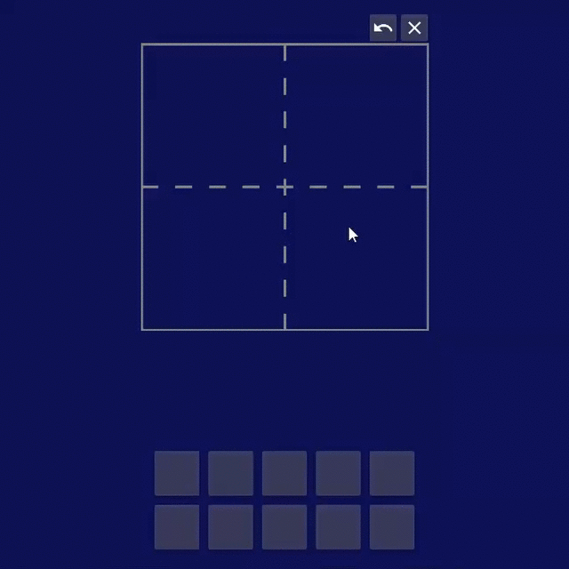

# DaKanji-Desktop


## What is this?

A simple app which can predict Japanese kanji characters which were drawn by hand.
The predictions can than be copied and used elsewhere. <br/>
Currently ~3000 kanji characters are supported.<br/>
The mobile version can be found [here.](https://github.com/CaptainDario/DaKanji-Mobile)




## What the users say:
* "Your program is like magic! Thank you so much!" - saszai2
* "Well thank you for this software! It seems to try and guess in a more "guess-y" way than jisho and even Google which is usually pretty good at guessing, and it just saved me today!" - princess_daphie
* "... I tried the program for the same kanji [some kanji], not only did all of them work but it was able to guess what I was going for before I finished too." - swolenkamel

## Getting started

### Running the executable
This is the recommended way of running the application. <br/>
You only have to head over to the [releases section](https://github.com/CaptainDario/DaKanji-desktop/releases) and download the latest release.
Unzip it and run the DaKanji executable inside the folder.<br/>

That's it!

### Running from source

**Note: Windows (10), Linux (Ubuntu 20.4) and MacOS are currently supported.**
**If you want to use this app on a different platform try running it from source.**

You can install all packages from the 'requirements.txt' (it is recommended to do this in a separate environment):

```
python -m pip install -r requirements.txt
```

Now the tensorflow lite models and the matching labels need to be downloaded and placed in the `data` folder.
They are available in the [DaKanji-ML repo.](https://github.com/CaptainDario/DaKanji-ML/releases)<br/>
Finally you should be able to run the application with:

```
python .\src\main.py
```

## Usage
Draw a character and the app tries to classify it.
The predictions can be copied by clicking on the buttons.<br/> 

On the settings page the URL of a dictionary can be entered (default is [jisho](jisho.org)).<br/>

**How to get the URL:**
The app will replace a placeholder in the URL with the predicted character.
This placeholder is: %X% <br/> 
Example:<br/>
The predicted character is: '口'
 and you want to open it on 'jisho.org'.
First you have to get the URL of the website for searching.
In this case: 'https://jisho.org/search/口'.
Now only the character in the URL has to be replaced with the placeholder.
This leads to 'https://jisho.org/search/%X%'.
<br/>
When long pressing a button the prediction will be opened in this dictionary.

## Development Notes

Python 3.8 with Qt (PySide2) were used for development.
See "running from source" for setting up the environment.<br/>
The Machine learning part of this project can be found in [this repository](https://github.com/CaptainDario/DaKanji-ML).

### Packaging the application
#### PyInstaller
For freezing the app with PyInstaller you have to run the 'build'-script in the main folder (make sure pyinstaller is installed because it is not included in the `requirements.txt`):
```
.venv_rel\Scripts\python.exe build.py
```
The script automatically detects the platform and outputs an executable for the system.

#### Windows Store Specific
To publish the application in the Microsoft store it needs to be in the .msix format.
To do this first the app needs to be converted from the PyInstaller executable to an .exe installer. The build script assumes that the `ISCC.exe` of the Inno Setup Compiler is in the path.
Now with the [MSIX packaging tool](https://docs.microsoft.com/en-us/windows/msix/packaging-tool/tool-overview) a .msix can be created.


## Next steps and ideas
If you want to suggest a new feature feel free to [open a new issue](https://github.com/CaptainDario/DaKanji-Desktop/issues).

## Common issues
* on Ubuntu 20.04 LTS exists a bug in PySide2 and the following command needs to be run to install dependencies:
```bash
sudo apt-get install -y libxcb-xinerama0
```

## Credits
  
* Icons were taken from the [material icon set](https://material.io/resources/icons/?style=baseline).
* design and UI: Massive shout out to [Ellina](https://github.com/nurellina)! Without your help the app would not look and feel half as good as it does now.
* icon/banner: 
  * Thanks "Buddha, with kudos to 2ch/fl/ and HatNyan" for helping with the icon design and making the banner. Also thank you [Adrian Jordanov](https://www.1001fonts.com/theater-font.html) for the banner font.