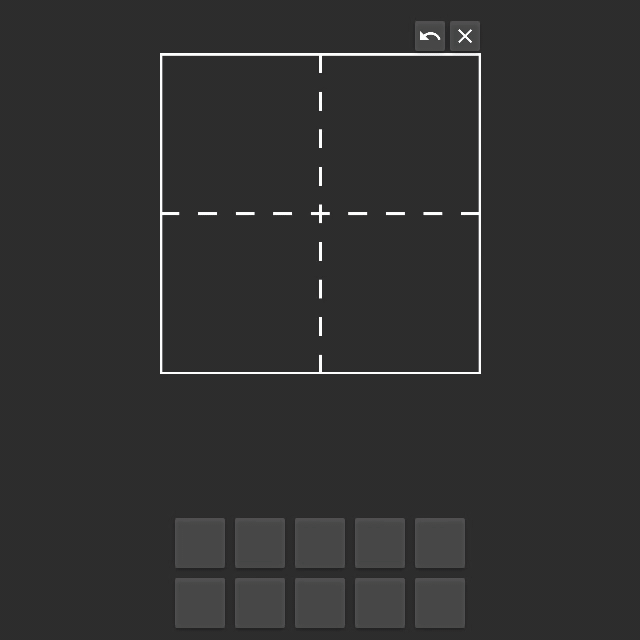

# DaKanjiRecognizer


## What is this?

A simple app which can predict japanese kanji characters which were drawn by hand.
The predictions can than be copied and used elsewhere. <br/>
Currently there ~3000 kanji characters supported.



## Getting started

### Running the exe
This is the recommended way of running the application. <br/>
You only have to head over to the [release section](https://github.com/CaptainDario/DaKanjiRecognizer/releases) and download the latest release.

Now you only have to unzip the directory and run the DaKanjiRecognizer.exe in the folder.<br/>

That's it!

### Running from source

**Note: Only Windows (10) is currently being supported.**
**If you want to use this app on MacOS or UNIX try to run the code from source (untested).**

Running the application from source is a little bit harder because you have to install all the necessary packages.<br/>
You can install all packages from the 'requirements_rel.txt' (it is recommended to do this in an separate environment):

```
python -m pip install -r requirements_rel.txt
```

Now you should be able to run the application with:
```
python .\src\main.py
```

## Usage
Draw a character and the app tries to classify it.
The predictions can be copied by clicking on the buttons.


## Development Notes

Python 3.8 and jupyter were used for development.

For development and training the network other packages are necessary than just for executing the application.
Therefore this project has two different "requirements.txt".

| name | usage |
|---|---|
| requirements_rel.txt | All packages which are necessary to run the application from source. |
| requirements_dev.txt | The packages which are necessary to develop and deploy the application.</br> Includes also the packages necessary to train the network and run the provided Jupyter notebook(s). |

First you need to install all packages from the 'requirements_rel.txt':

```
python -m pip install -r requirements_rel.txt
```
Because the training of the CNN heavily relies on my custom python package 'etl_data_reader' you have to install it too. <br/>
First the wheel package has to be installed:

```
python -m pip install wheel
```

and afterwards either:
* Download the latest wheel from the [etl_data_reader repo](https://github.com/CaptainDario/ETL_data_reader/releases) and install it:
```
python -m pip install path\to\the\downloaded\etl_data_reader.whl
```
* or download it with pip:
```
python-m pip install https://github.com/CaptainDario/ETL_data_reader/releases/download/1.0/etl_data_reader_CaptainDario-1.0-py3-none-any.whl
```

How the network was setup and developed can be seen [in this jupyter notebook](./docs/DaKanjiRecognizer.html).

## PyInstaller
For freezing the app with PyInstaller you have to run the 'build'-script in the main folder:
```
.venv_rel\Scripts\python.exe build.py
```

## Next steps and ideas
* Rewrite the python code in c++ or flutter to build for desktop, mobile and web.

## Credits
The data on which the neural network was trained on was kindly provided by [ETL Character Database](http://etlcdb.db.aist.go.jp/obtaining-etl-character-database) <br/><br/>
Papers:<br/>
* [Recognizing Handwritten Japanese Characters Using Deep Convolutional Neural Networks](http://cs231n.stanford.edu/reports/2016/pdfs/262_Report.pdf) <br/>
* [A neural framework for online recognition of handwritten Kanji characters](https://www.researchgate.net/publication/327893142_A_neural_framework_for_online_recognition_of_handwritten_Kanji_characters) <br/>
* [Online Handwritten Kanji Recognition Based on Inter-stroke Grammar](https://www.researchgate.net/publication/4288187_Online_Handwritten_Kanji_Recognition_Based_on_Inter-stroke_Grammar) <br/><br/>
  
Icons were taken from the [material icon set](https://material.io/resources/icons/?style=baseline).